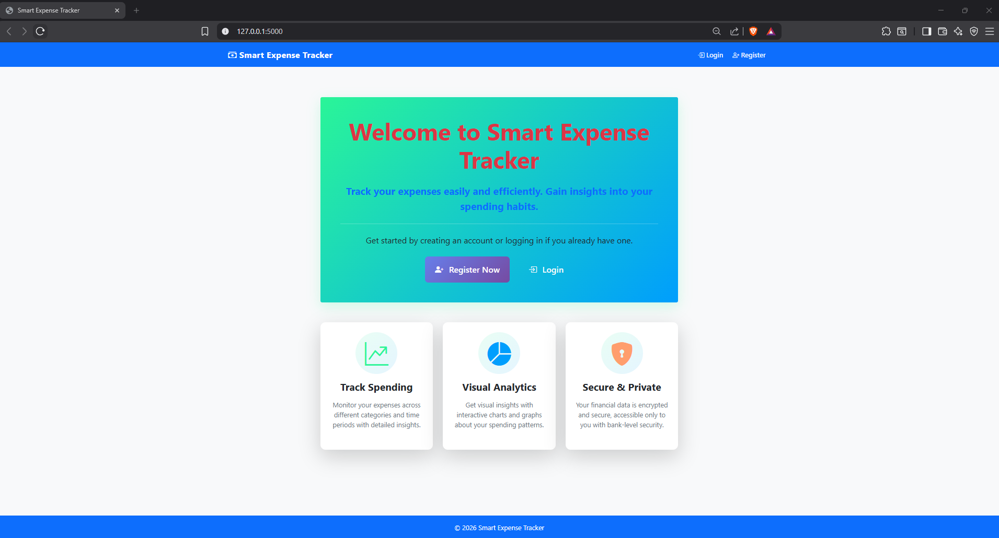
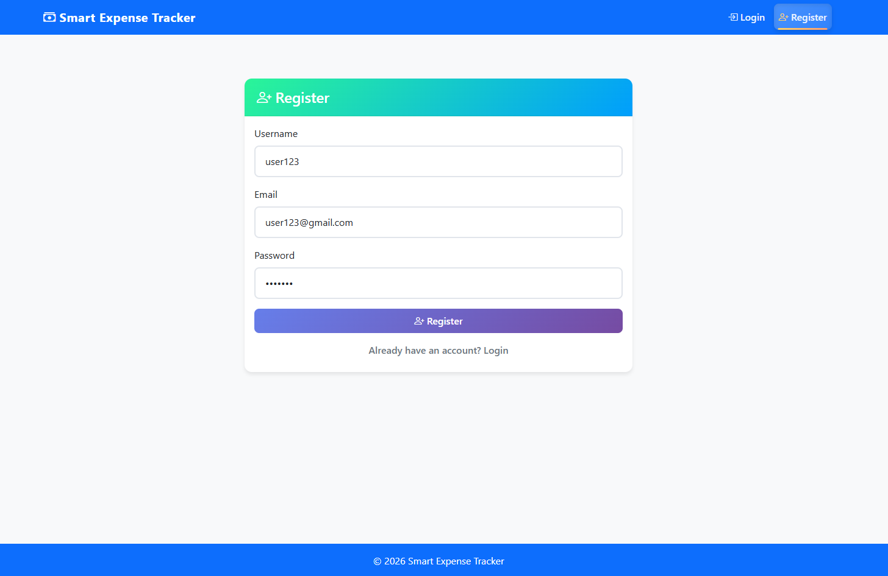
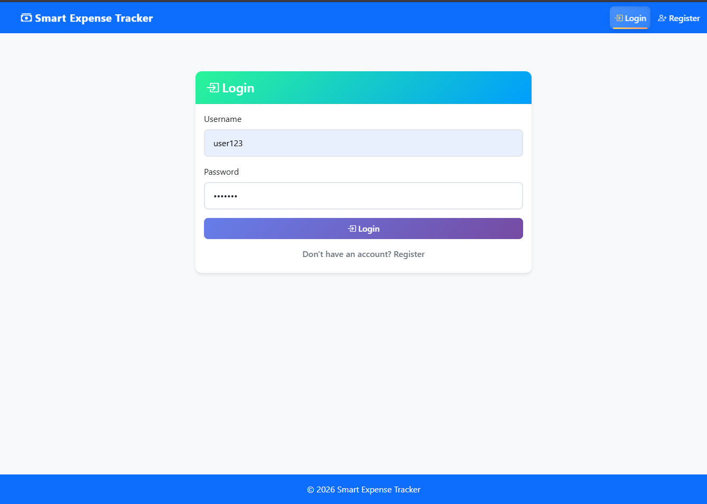
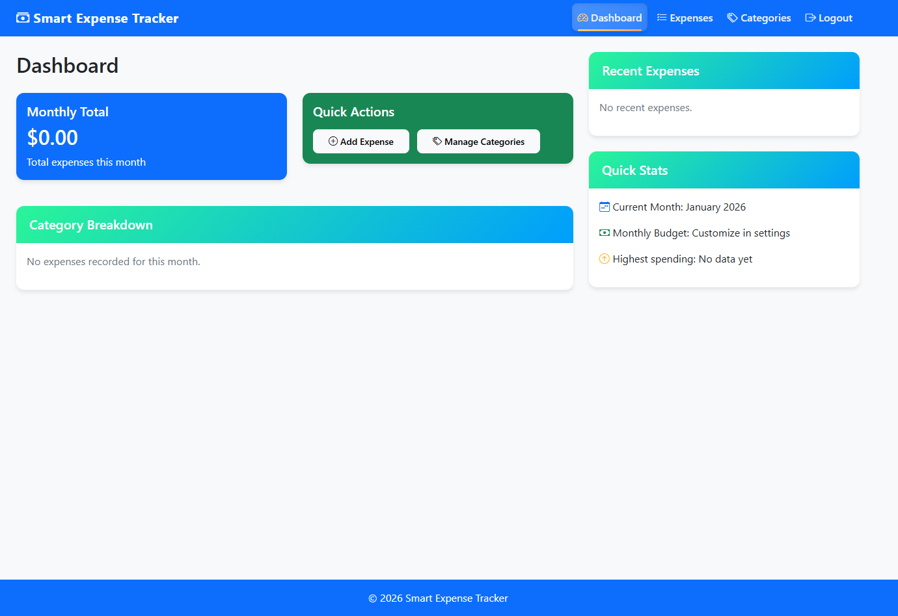
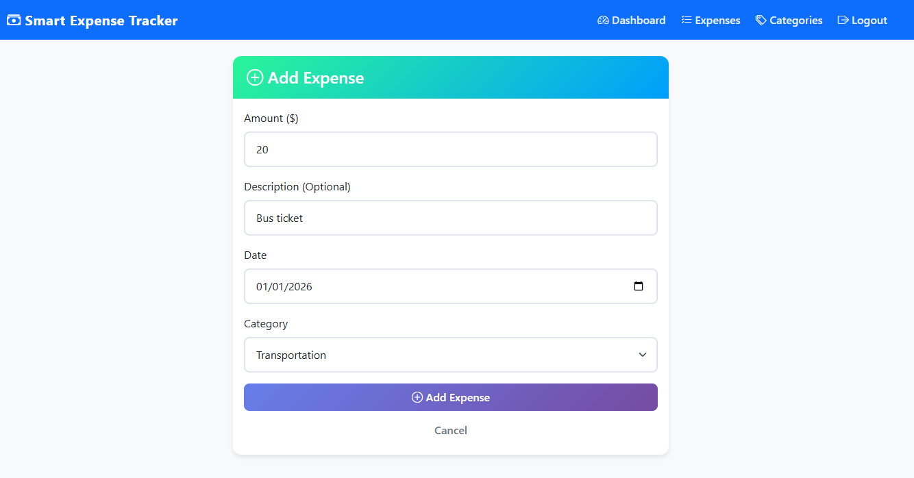
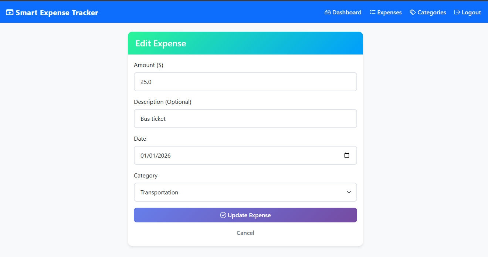
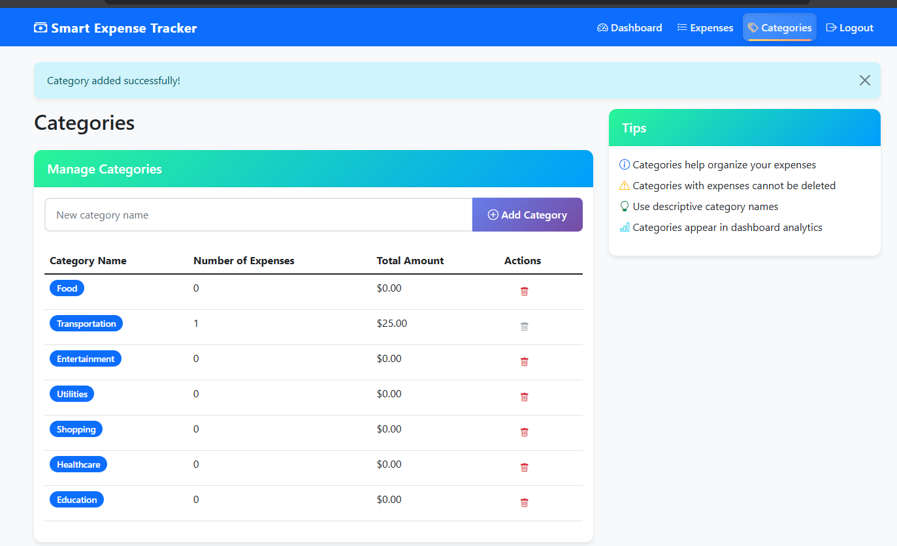
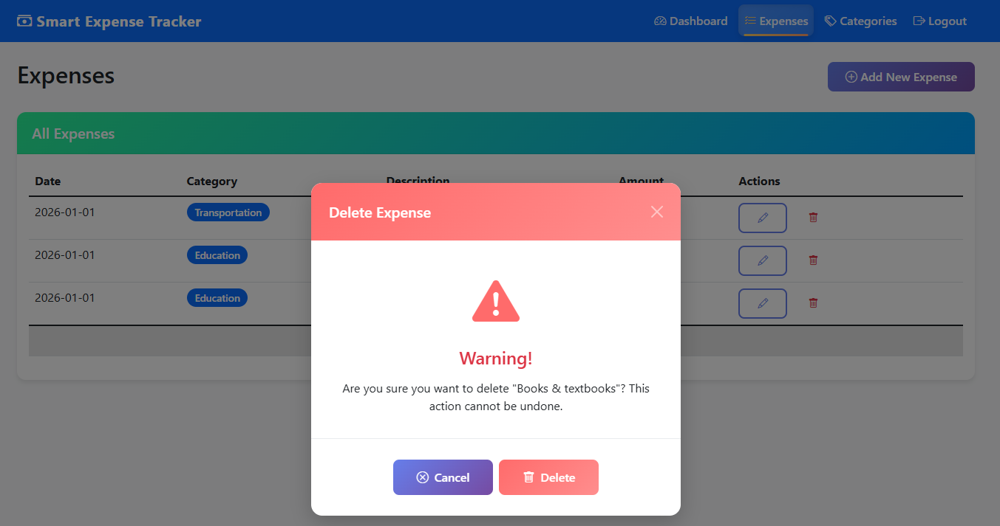
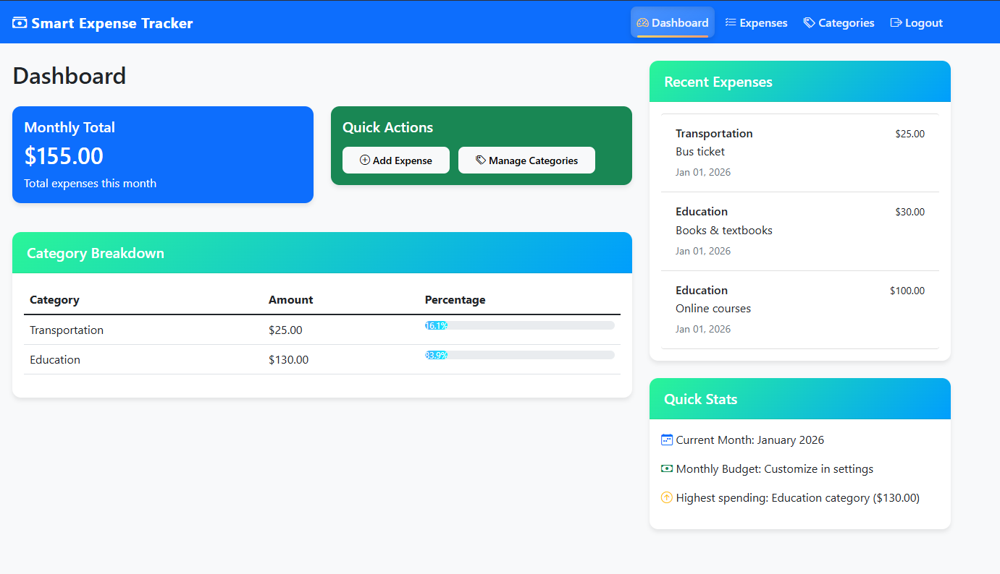

# 💰 Expense Tracker Application (Flask)

A **modern, secure, and user-friendly Expense Tracker web application** built using **Flask**.  
This application helps users **track daily expenses**, **manage categories**, and **analyze spending patterns** through an interactive dashboard.

The project follows **best practices in security, modular design, and UI/UX**, making it ideal for learning Flask-based full-stack development.

---

## ✨ Features

### 🔐 User Authentication
Secure user registration and login with hashed passwords, session management, and protected routes using Flask-Login.

---

### 💰 Expense Management (CRUD)
Create, view, update, and delete expense records with category, date, and amount tracking.

---

### 🏷️ Category Management
Manage default and custom expense categories with safeguards against deleting categories in use.

---

### 📊 Dashboard & Analytics
Interactive dashboard displaying monthly expenses, category-wise breakdowns, and recent activity insights.

---

### 🎨 Modern UI / UX
Responsive and visually appealing interface built with Bootstrap 5, featuring smooth interactions and real-time feedback.

---

### 🔧 Technical Highlights
Flask-based modular architecture using SQLite, ORM-driven database access, secure coding practices, and graceful error handling.

---

## 🛠️ Tech Stack

### Backend
- **Flask 2.3.3** – Python web framework
- **Flask-Login 0.6.3** – User authentication & session management
- **Flask-SQLAlchemy 3.0.5** – ORM for database handling
- **Werkzeug 2.3.7** – Security utilities
- **SQLite** – Database engine

### Frontend
- **Bootstrap 5** – CSS framework
- **Bootstrap Icons** – Icon library
- **JavaScript** – Interactive functionality
- **HTML5 & CSS3** – UI structure and styling

### Development Tools
- **Python 3.8+**
- **Jinja2** – Templating engine
- **Git** – Version control

---

---

## Getting Started

### Clone the Repository
``` bash
git clone https://github.com/Kapilan1998/Flask-smart-expense-tracker.git
cd Flask-smart-expense-tracker
```

### Install Dependencies
``` bash
pip install -r requirements.txt
```

### Run the Application
``` bash
python app.py
```

### Access the Application
``` bash
http://localhost:5000/
```

### Dashboard






















---
